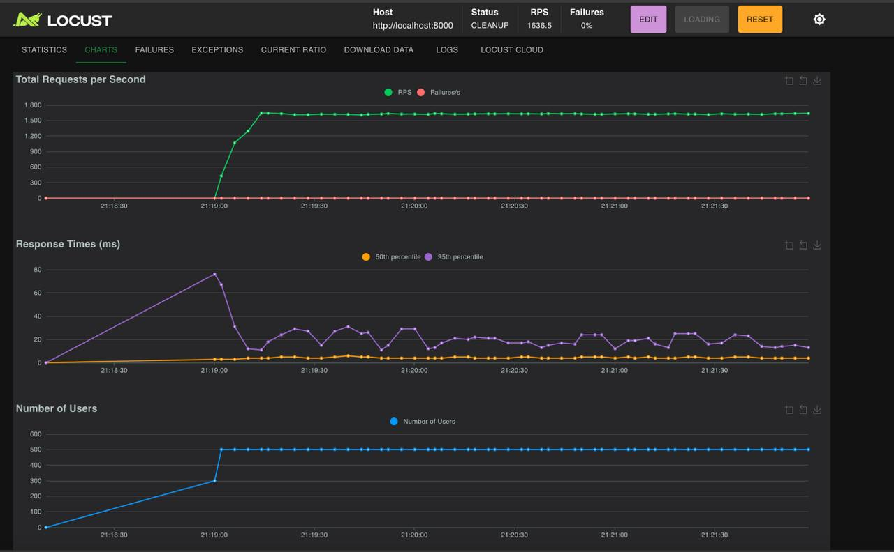
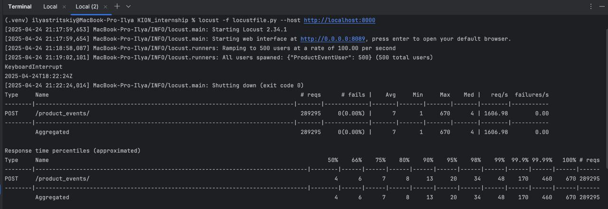

## О проекте:
Микросервис дедупликатора продуктовых событий на Python
___
## Как начать?
#### 1. Клонируйте данный репозиторий локально на ваше устройство
```bash
git@github.com:IlyacloudDev/KION-internship.git
```
#### 2. Находясь на том же уровне, что и Dockerfile, docker-compose.dev.yml, создайте файл .env с переменными окружения проекта и пропишите значения для переменных
*(примерное оформление .env)*:
```
SECRET_KEY=something

POSTGRES_USERNAME=something
POSTGRES_PASSWORD=something
POSTGRES_HOST=something
POSTGRES_PORT=something
POSTGRES_DATABASE=something

RABBITMQ_DEFAULT_USER=something
RABBITMQ_DEFAULT_PASS=something
RABBITMQ_HOST=something
RABBITMQ_PORT=something
RABBITMQ_URL=something


CELERY_BROKER_URL=something

REDIS_HOST=something
REDIS_PORT=something
REDIS_DB=something
```
#### 3. Запустите docker-compose.dev.yml
```bash
docker-compose -f docker-compose.dev.yml up -d
````
___
## Как протестировать?
- Можно сделать ручное тестирование через Postman

#### Для этого используйте адрес http://127.0.0.1:8000/product_events/ с POST-методом запроса. 

Вот два примера JSON-ов продуктовых событий для теста:
```json
{
  "event_name": "app_list",
  "event_datetime": "2025-04-10T12:34:56.000Z",
  "event_date": "2025-04-10",
  "client_id": "abc123def456",
  "product_id": "prod-001",
  "sid": "session-123",
  "ts": "2025-04-10T15:34:56.000+03:00",
  "r": "999888777666555",
  "platform": "android",
  "user_agent": "ru.mts.mtstv/1.2.345",
  "price": 499,
  "dt_add": "2025-04-10T15:34:59.123Z",
  "event_receive_timestamp": 1744287299,
  "event_receive_dt_str": "2025-04-10 15:34:59.123456"
}
```
```json
{
  "event_name": "content_play",
  "event_datetime": "2025-04-10T13:00:01.000Z",
  "event_date": "2025-04-10",
  "client_id": "xyz789ghj321",
  "product_id": "prod-002",
  "sid": "session-456",
  "ts": "2025-04-10T16:00:01.000+03:00",
  "r": "111222333444555",
  "platform": "android",
  "user_agent": "ru.mts.mtstv/1.2.345",
  "price": 299,
  "dt_add": "2025-04-10T16:00:05.456Z",
  "event_receive_timestamp": 1744288805,
  "event_receive_dt_str": "2025-04-10 16:00:05.456789"
}
```
>[!NOTE]
> В PostgreSQL будут добавлены только уникальные продуктовые события
- Можно сделать высоконагруженное тестирование через Locust

#### Для этого, находясь на том же уровне, что и файл manage.py, запустите Locust
```bash
locust -f locustfile.py --users 500 --spawn-rate 100 --host http://localhost:8000 
```
Перейдите на http://0.0.0.0:8089 и начните запуск тестирования
- Для очищения контейнеров PostgreSQL, Redis и Bloom-фильтра используйте:
```bash
docker exec -it postgres psql -U postgres -d kion_internship -c "TRUNCATE TABLE product_events_productevent RESTART IDENTITY CASCADE;"
docker exec -it redis redis-cli flushall
docker exec -it redis redis-cli DEL product_event_bloom
```
___
## Как работает?
#### 1. Есть API-эндпоинт, который принимает POST-запросы с продуктовыми событиями и асинхронно через Celery записывает продуктовые события в брокер сообщений RabbitMQ

#### 2. Следующим шагом начинается работа консьюмера RabbitMQ, который забирает продуктовые события из брокера сообщений и отдает функции, которая проверяет событие на дубликат

#### 3. Проверка на дубликат идет в 2 шага: сначала через фильтр Блума на основе RedisBloom, а потом через хеши продуктовых событий, которые хранятся в Redis

#### 4. Если продуктовое событие дубликат - оно отбрасывается, если же нет, сохраняется в PostgreSQL для дальнейшей аналитики

___
### Пример статистики при высоконагруженном тестировании через Locust
*Параметры locust - (users: 500; ram up: 100; time: 3m)*

